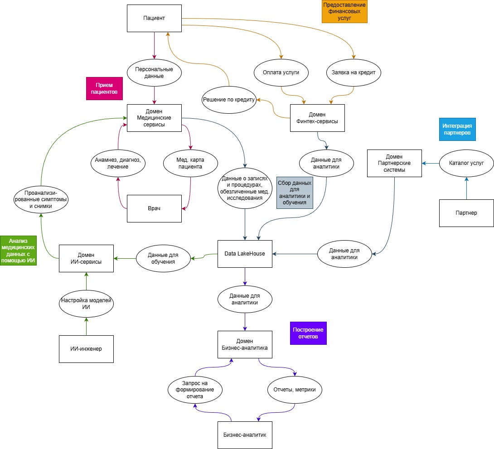

## Задание 2. Разделение системы на домены и моделирование потоков данных для поддержки ключевых бизнес-сценариев

### Разделение на домены

При разделении на домены будем опираться на закон Конвея: «организации проектируют системы, которые копируют структуру коммуникаций в этой организации». Т.е. доменная структура будет соответствовать организационной структуре компании.

| Домен | Описание | Связь с бизнес-сценариями |
| ----- | -------- | ------------------------- |
| Медицинские сервисы | Осуществляет медицинские услуги. Владеет данными по клиентам, медицинским картам и историям болезни | Обеспечение работы клиник, хранение чувствительных данных, обеспечение информационной безопасности и соблюдение требований регуляторов в части работы с медицинскими данными. |
| Финтех-сервисы | Владеет данными о финансовых опирециях и банковских услугах | Отдельный домен позволяет улучшать расчёты и соответствовать требованиям регуляторов без влияния на другие сервисы. |
| ИИ-сервисы | ИИ-сервисы для медицинской аналитики и диагностики. Потребляет обогащенные данные из других доменов | Решение исследовательских задач, построение систем рекомендаций. Домен должен быть автономным, чтобы медицинская система не зависела от частых обновлений моделей диагностики и обучающие датасеты хранились отдельно. |
| Партнерские системы | Владеет данными о взаимодействиях с внешними партнерами: заказ лекарств, управление медицинским оборудованием, интеграция с поставщиками | Подключение новых бизнесов — стратегическая цель компании. Отдельный домен упрощает интеграцию новых партнёров без влияния на медицину и финтех. |
| Бизнес-аналитика | Сервис для бизнес-аналитики и формирования отчетов на основе данных из DataLakehouse | Формирование отчетов, анализ бизнес-показателей, мониторинг KPI. Выделение в отдельный домен решает проблемы с медленным формированием отчетности. |

Команды доменов могут независимо развивать свои продукты. Для запуска финтех-сервиса или добавления интеграции с новым партнером не нужно ждать очереди на изменение центрального DWH, т.к. необходимыми данными владеют сами домены. Это сокращает time-to-market.

### Аргументация

#### Основные принципы

1. Принцип единственной ответственности
Каждый домен отвечает за свою бизнес-область

2. Слабая связанность
Домены общаются через стандартизированные интерфейсы, изменения в одном домене не затрагивают другие

3. Независимая работа команд
Каждый домен может развиваться в своем темпе; независимые циклы разработки

#### Выгода для бизнеса

- Для клиник: независимое развитие сокращает time-to-market

- Для финтеха: независимое развитие банковских продуктов в соответствии с финансовыми регуляторами

- Для ИИ-направления: быстрое экспериментирование с новыми алгоритмами на реальных данных

- Для руководства: своевременная отчетность по всем направлениям через единый портал

- Для партнеров: стандартизированный процесс интеграции

### Диаграмма потоков данных

Данные для аналитики и обучения берутся из Data LakeHouse. При этом важно отметить, что в «витрину данных» не должны включаться медицинские карты, истории болезней и результаты медицинских исследований - это требование бизнеса.