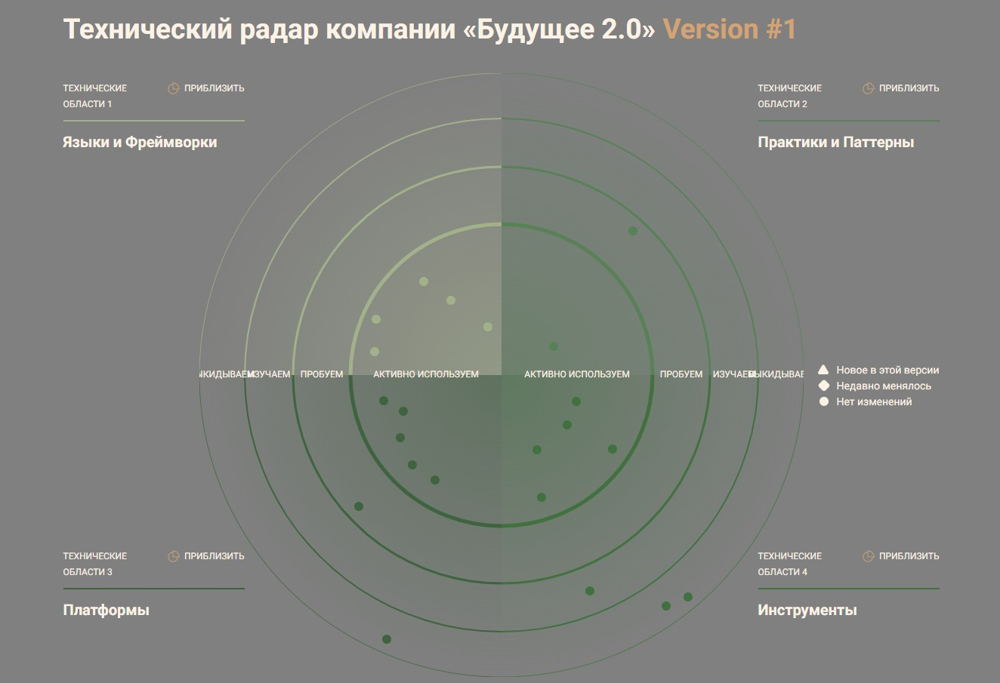

## Задание 3. Разработка технологического радара и роадмапа изменений для поддержки бизнес-целей компании

### 1. Технический радар

#### Связь технологий с бизнес-задачами

1 Быстрая отчетность

- Data Lakehouse/Apache Iceberg
- Data Mesh
- Yandex Datalens
- Apache Airflow

2 Добавление нового функционала и подключение новых бизнесов

- Kong Gateway
- Apache Kafka
- Keycloak
- RAG

3 Снижение издержек на разработку и поддержку системы

- Обновление технологического стека
- Terraform
- Kubernetes
- Prometheus/Grafana

### 2. Роадмап

| Инициатива                       | Период     | Основные действия                                               |  Ответственные            | Ресурсы               |
| -------------------------------- | ---------- | --------------------------------------------------------------- | ------------------------- | --------------------- |
| Подготовка инфраструктуры        | Q1–Q2 2026 | Внедрение Kubernetes, CI/CD, централизованной авторизации (IAM) | DevOps Team               | Облако                |
| Разделение на домены             | Q2–Q3 2026 | Реализация Data Mesh, выделение доменов Clinic, Fintech, AI     | Архитектурная команда     | Kafka, DWH, DataOps   |
| Портал самообслуживания          | Q2-Q4 2026 | Разработка, использование IAM, тестирование                     | BI / Frontend / Backend   | Ресурсы на разработку |
| AI-интеграции и аналитика        | Q4 2026    | Внедрение Airflow, подключение AI к медицинским данным          | Команда Data Science и AI | GPU                   |
| Интеграция с внешними партнёрами | Q1 2026    | Интеграция с партнерами (фармацевтика и электроника) через API  | Backend                   | API Gateway           |
| Мониторинг и контроль качества   | Q1–Q2 2026 | Настройка OpenTelemetry, SLA, дашборды качества                 | SRE-инженеры              | Grafana, Prometheus   |

### 3. Обоснование изменений

| Инициатива                       | Бизнес-цель                                            | Результат                                  | Влияние на бизнес                                                    |
| -------------------------------- | ------------------------------------------------------ | ------------------------------------------ | -------------------------------------------------------------------- |
| Подготовка инфраструктуры        | Ускорить выпуск сервисов                               | Унифицированная среда для сервисов         | Сокращение time-to-market, стабильная среда                          |
| Разделение на домены             | Уменьшить зависимость от DWH и централизованных команд | Независимое развитие направлений           | Рост автономности и скорости разработки                              |
| Портал самообслуживания          | Добиться самообслуживания по отчетам                   | Удобство построения отчетов                | Рост скорости принятия решений; снижение нагрузки на IT-команду, DWH |
| AI-интеграции и аналитика        | Улучшить диагностику и прогнозирование                 | Прогнозы и диагностика в реальном времени  | Повышение точности решений и снижение ошибок                         |
| Интеграция с внешними партнёрами | Открыть новые источники дохода                         | Расширение экосистемы компании             | Расширение экосистемы, интеграция внешних API                        |
| Мониторинг и контроль качества   | Снизить операционные риски                             | Стабильность медицинских и финтех-сервисов | Прозрачность, контроль SLA, повышение доверия                        |
