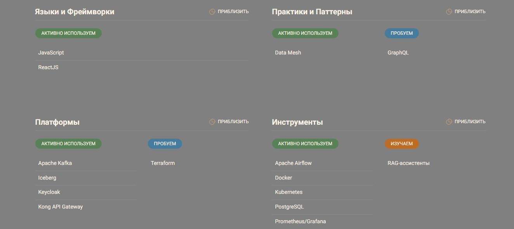

## Задание 3. Разработка технологического радара и роадмапа изменений для поддержки бизнес-целей компании

### 1. Технический радар

Технологии, которые уже используются, помечены тегом "old":

Технологии, которые планируется внедрять, помечены тегом "new":

#### Связь технологий с бизнес-задачами

| Технология           | Описание | Бизнес-задача |
| -------------------- | -------- | ------------- |
| Golang, Java, Python | Языки для бекенд-разработки | Совместимость с текущими сервисами (ИИ, финтех), создание новых сервисов |
| JavaScript, ReactJS  | Языки для фронтенд-разработки | Создание новых сервисов (портал самообслуживания) |
| Apache Kafka         | Распределённый брокер сообщений | Асинхронный обмен событиями между доменами |
| Apache Camel         | Платформа интеграции приложений | Интеграция с унаследованными системами. Можно будет отказаться по мере избавления от легаси систем |
| Data Lakehouse с Apache Iceberg | Гибридное решение для хранения данных | Быстрое формирование отчётности |
| Data Mesh            | Децентрализованный подход к построению распределенной архитектуры данных | Интеграция новых бизнесов, автономное развитие направлений |
| Keycloak             | Продукт для реализации single sign-on с возможностью управления доступом | Единая точка аутентификации и авторизации, централизованное управление доступом к данным, безопасная интеграция партнеров |
| Kong Gateway         | API шлюз на базе Nginx | Единый API Gateway для всех доменов, безопасная интеграция партнеров, контроль трафика между сервисами |
| Apache Airflow       | Платформа управления обработкой данных | Разработка систем обработки данных. Построение витрины данных, отчётов. Подготовка данных для машинного обучения |
| Docker               | Платформа для контейнеризации приложений | Масштабируемость сервисов, снижение времени развертывания |
| Kuberbetes           | Оркестратор контейнеров | Масштабируемость сервисов, снижение времени развертывания |
| Terraform            | Инструмент для управления инфраструктурой как кодом | Повторяемость развертывания инфраструктуры, снижение ручного труда, повышение скорости развертывания |
| Prometheus + Grafana | Связка инструментов для мониторинга IT-инфраструктуры | Наблюдаемость пайплайнов и платформ: сбор метрик, логов, трейсов; контроль SLA/SLO |
| RAG                  | Технология, которая соединяет языковую модель с внешней базой знаний | Увеличить эффект от внедрения ИИ в бизнес и повысить точность ответов LLM |
| GraphQL              | Язык запросов для API-интерфейсов и среда, в которой они выполняются | Унификация API |
| Power BI             | Платформа для анализа данных, их визуализации и создания интерактивных отчетов | Используется в текущей BI-системе. Портал самообслуживания, визуализация метрик |
| Power Builder        | Интегрированная среда разработки приложений баз данных | Используется для доступа операторов в клиниках к данным. Планируется отказ от устаревшей технологии, для которой трудно найти разработчиков |
| PostgreSQL           | Реляционная система управления базами данных | Построение DWH внутри каждого домена |
| MSSQL Server 2008    | Реляционная система управления базами данных | Устаревшая версия, используемая в монолитном DWH. Требует замены ввиду отсутствия поддержки и высоких рисков безопасности. |

### 2. Роадмап

| Инициатива                       | Период     | Основные действия                                               |  Ответственные            | Ресурсы               |
| -------------------------------- | ---------- | --------------------------------------------------------------- | ------------------------- | --------------------- |
| Подготовка инфраструктуры        | Q1–Q2 2026 | Внедрение Kubernetes, CI/CD, централизованной авторизации (IAM) | DevOps Team               | Облако                |
| Разделение на домены             | Q2–Q3 2026 | Реализация Data Mesh, выделение доменов Clinic, Fintech, AI, BI | Архитектурная команда     | Kafka, DWH, DataOps   |
| Портал самообслуживания          | Q2-Q4 2026 | Разработка, использование IAM, тестирование                     | BI / Frontend / Backend   | Ресурсы на разработку |
| AI-интеграции и аналитика        | Q4 2026    | Внедрение Airflow, подключение AI к медицинским данным          | Команда Data Science и AI | GPU                   |
| Интеграция с внешними партнёрами | Q1 2026    | Интеграция с партнерами (фармацевтика и электроника) через API  | Backend                   | API Gateway           |
| Мониторинг и контроль качества   | Q1–Q2 2026 | Настройка OpenTelemetry, дашборды качества                      | SRE-инженеры              | Grafana, Prometheus   |

### 3. Обоснование изменений

| Инициатива                       | Бизнес-цель                                            | Результат                                  | Влияние на бизнес                                                    |
| -------------------------------- | ------------------------------------------------------ | ------------------------------------------ | -------------------------------------------------------------------- |
| Подготовка инфраструктуры        | Ускорить выпуск сервисов                               | Унифицированная среда для сервисов         | Сокращение time-to-market, стабильная среда                          |
| Разделение на домены             | Уменьшить зависимость от DWH и централизованных команд | Независимое развитие направлений           | Рост автономности и скорости разработки                              |
| Портал самообслуживания          | Добиться самообслуживания по отчетам                   | Удобство построения отчетов                | Рост скорости принятия решений; снижение нагрузки на IT-команду, DWH |
| AI-интеграции и аналитика        | Улучшить диагностику и прогнозирование                 | Прогнозы и диагностика в реальном времени  | Повышение точности решений и снижение ошибок                         |
| Интеграция с внешними партнёрами | Открыть новые источники дохода                         | Расширение экосистемы компании             | Расширение экосистемы, интеграция внешних API                        |
| Мониторинг и контроль качества   | Снизить операционные риски                             | Стабильность медицинских и финтех-сервисов | Прозрачность, контроль качества, повышение доверия                   |
